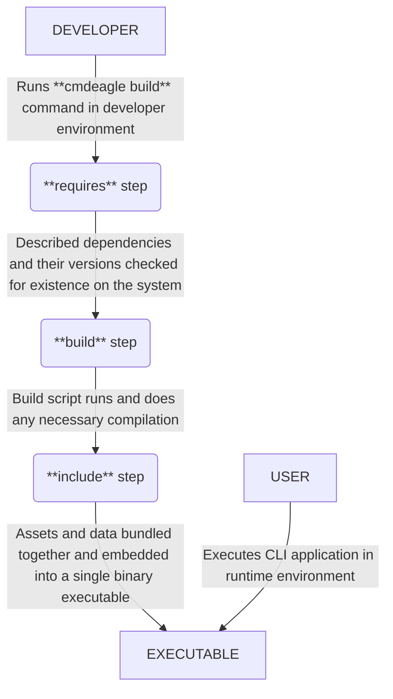
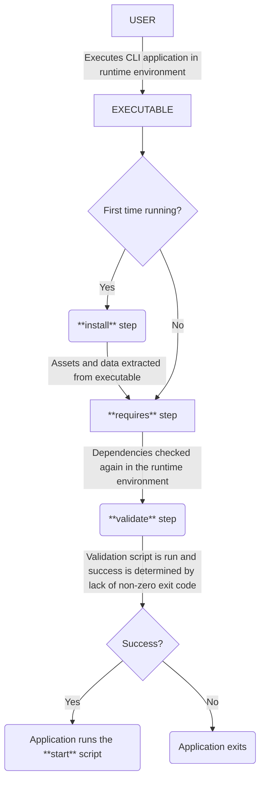

# cmdeagle

_**WARNING:** This is very much a work in progress, but we're close to releasing a stable version 1. Check back soon. Feedback is also much appreciated._

A language-agnostic CLI application build tool that allows you to create cross-platform applications written in any programming language of your choice.

## Features

- Define commands and subcommands from a single YAML configuration file.
- Reuse your existing external scripts and binaries to build commands.
- Define, parse, and validate your arguments and flags into environment variables your scripts can use.
- Create build steps and declare data/assets to install your commands.

## Quick Start

The easiest way to work with cmdeagle right now is by [installing it with Go](https://go.dev/doc/install) on a unix-like system (macOS, Linux, etc). More platforms will be supported soon.

### 1) Install it with Go's package manager

```sh
go install github.com/migsc/cmdeagle@latest
```

Go 1.23.2 or later is required. Install it from [Golang's website](https://go.dev/doc/install).
<!-- - Node.js (v16.17.0+) -->
<!-- - Node.js Package Manager (npm) -->

### 2) Initializing a starter project

```sh
cmdeagle init mycli
```

Where `mycli` is the name of the executable file you want to build. By default, the binary will be named after the directory you run the command from. You can [change this later](#cli-level-name-key).

### 3) Building the CLI:

To build a binary for your CLI, run the following command in the root directory of your project:

```sh
cmdeagle build
```

On macOS and Linux, the binary will be built to either the `./usr/local/bin` directory if you have the necessary write permissions, or the `~/.local/bin` directory if you don't.

The binary will only run on your current operating system and architecture. However, you can target other platforms using specific flags. See the [reference](#reference) for more details.

Currently, internet connectivity is required for the Go build process to resolve and download modules for the wrapper application that `cmdeagle` generates to bundle your scripts and assets. If all dependencies are cached, you can build the project offline. We plan to improve this process in future releases to further reduce the need for internet connectivity during builds.

The sample scripts are defined in several different languages to help you get started. For Python, JavaScript, and other interpreted languages, the scripts are bundled together with the executable file, thanks to the file paths defined in the `includes` setting:

```sh
includes:
- "./greet.sh"
- "./greet.js"
- "./greet.py"
```

This is useful for bundling scripts, static assets, media, configuration files, data files, etc.

However, if you're using Go or another compiled language, bundling executable binaries into your `cmdeagle`-built binary is not allowed for security reasons. Instead, you must use the `CLI_BIN_DIR` variable within the `build` script setting at a subcommand or root level of your `.cmd.yaml`:

```yaml
build: |
  go build -o $CLI_BIN_DIR/mycli-go-binary greet.go
```

Here, Golang's `go build` command is used to compile the `greet.go` file and write the resulting executable to the directory specified by the `$CLI_BIN_DIR` environment variable.

Note that `$CLI_BIN_DIR` is an environment variable defined by `cmdeagle` within the shell where the `build` script runs. It points to the directory where the executable file should be built, matching the directory where the CLI's executable file will be written. Unfortunately, it's not yet possible to override this to point to a different directory, but we plan to add this feature in a future release.

### 4) Running your CLI

You can run the executable file from your current working directory or from anywhere on your system if you add its directory to your system's `PATH` variable.

The `greet` command is a sample subcommand that you can use as a starting point. It's defined in the `.cmd.yaml` file and is configured to run the sample scripts in the project.

Let's test it out:

```sh
mycli greet cmdeagle 2 --uppercase --repeat 3
HELLO CMDEAGLE! YOU ARE 2 YEARS OLD.
HELLO CMDEAGLE! YOU ARE 2 YEARS OLD.
HELLO CMDEAGLE! YOU ARE 2 YEARS OLD.
```

You can get more information about the `greet` command by running:

```sh
mycli help greet
```

The name and age arguments, along with the `--uppercase` and `--repeat` flags, are defined in the `.cmd.yaml` file. Have a look and read the comments to learn how each configuration key works. You can also read the [reference](#reference) for more details on how to define your own commands, flags, and arguments.

For now, let's focus on the `start` script defined for the `greet` subcommand:

```yaml
  start: |
    if [ "${flags.use-python}" = "true" ]; then
      python3 greet.py
    elif [ "${flags.use-js}" = "true" ]; then
      node greet.js
    elif [ "${flags.use-go}" = "true" ]; then
      ./{{name}}-go-binary
    else
      sh greet.sh
    fi
```

Note that it runs the `mycli-go-binary` mentioned before if the `--use-go` flag is passed. The flag could have easily been handled within the code of the `greet.py` and `greet.js` files, but we're doing it this way here to demonstrate a self-contained example of what a `start` script is capable of doing.

Let's invoke the built-in `help` command now:

```sh
mycli help

Usage:
  mycli [flags]
  mycli [command]

Available Commands:
  completion  Generate the autocompletion script for the specified shell
  greet       Greet the user.
  help        Help about any command

Flags:
  -h, --help   help for mycli

Use "mycli [command] --help" for more information about a command.
```

Where `mycli` was the name you created in [step 2](#_2-initialize-a-cli-starter-project-named-mycli).

The `completion` command will generate a script for your CLI to use in your shell. This is made possible because `cmdeagle` uses [Cobra](https://github.com/spf13/cobra) under the hood. <!--IMPLEMENT--> You can turn this off by setting the `completion` key to `false` at the root level of the `.cmd.yaml` file.

Currently, `cmdeagle` primarily uses Cobra for parsing arguments, flags, and subcommands. While we don't yet take full advantage of all the rich features Cobra provides, we plan to integrate more of these capabilities in future releases to enhance the functionality and flexibility of your CLI applications.


## Reference

This section provides detailed documentation for all configuration options, commands, and features available in cmdeagle. Use this reference to understand how to configure your CLI application, define commands and subcommands, set up arguments and flags, and implement the various lifecycle scripts that power your CLI's functionality.

The reference is organized by topic, starting with the configuration structure and moving through each aspect of CLI development with cmdeagle. Each section includes examples and explanations to help you implement the features in your own projects.

### Configuring your CLI 

Your CLI's schema is defined in a [YAML](https://en.wikipedia.org/wiki/YAML#cite_note-19) file named `.cmd.yaml`. There, you define your CLI's basic information and metadata, top-level command and sub commands, validation and parsing rules for your arguments and flags, build steps, bundled assets, and more.

#### Configuration structure

The `.cmd.yaml` file has a tree-like structure that mirrors the command hierarchy of your CLI application:

- The **root level** contains both application-wide configuration (like `completion`) and configuration for the root command itself (the command invoked when users run your CLI without any subcommands)
- **Subcommands** are defined under the `commands` key and can have their own subcommands, forming a hierarchical tree
- Each command node (root or subcommand) can have its own configuration for arguments, flags, lifecycle scripts, etc.

This hierarchical structure allows you to organize complex CLIs with multiple levels of commands while maintaining a clear and logical configuration.

#### Root-level configuration

The root level of your `.cmd.yaml` file contains two types of configuration:

1. **Application-level configuration**: Settings that apply to the entire CLI application
2. **Root command configuration**: Settings that define the behavior of your CLI when invoked without subcommands


##### Application-level Configuration

These settings apply to the entire CLI application:


###### `name` key

Defines the name of your CLI executable. This is what users will type to invoke your CLI.

```yaml
name: mycli
```

###### `description` key

A short description of your CLI that appears in help text and documentation.

```yaml
description: "A tool for managing widgets"
```

###### `version` key

The version number of your CLI. This is displayed when users run your CLI with the `--version` flag.

```yaml
version: "1.0.0"
```

###### `author` key

The name of the author or organization that created the CLI.

```yaml
author: "Jane Doe <jane@example.com>"
```

###### `license` key

The license under which your CLI is distributed.

```yaml
license: "MIT"
```

###### `completion` key

Controls whether the built-in command completion functionality is enabled. Defaults to `true`.

```yaml
completion: true  # Enable shell completion support
```

#### Configuring commands

Commands are the core building blocks of your CLI application. Each command (whether the root command or a subcommand) can be configured with various options that define its behavior, arguments, flags, and execution logic. This section covers all the configuration options available for commands at any level in your command hierarchy.

The following configuration keys can be used within any command definition, including the root command and all subcommands:

###### `commands` key

At the root level, the `commands` key defines the top-level subcommands of your CLI application. These are the commands 
that users can run directly after your CLI name.

Each command in defined in the `commands` (or the single one at the root level) defines subcommands for either the root 
command or another subcommand. It contains an array of command objects, each representing a subcommand with its own configuration.

```yaml
commands:
  - name: subcommand1
    description: "First subcommand"
    # other subcommand configuration...
    
  - name: subcommand2
    description: "Second subcommand"
    # other subcommand configuration...
    
    # Nested subcommands
    commands:
      - name: nested
        description: "A nested subcommand"
        # nested subcommand configuration...
```

With this configuration, users can run commands like:
```sh
mycli subcommand1
mycli subcommand2
mycli subcommand2 nested
```

Each command defined here can have its own configuration including [arguments](#arguments-and-flags), [flags](#arguments-and-flags), [lifecycle scripts](#command-lifecycle-configuration), and even [nested subcommands](#top-level-command-and-sub-commands) (using their own `commands` key).

The `commands` key is how you build the command tree structure of your CLI application, starting from these top-level commands. In the next section, we'll look at how to define subcommands and their configuration. For the sake of brevity, we'll use the term "command" to refer to both top-level command and subcommands.

###### Command lifecycle configuration

Commands in cmdeagle have a well-defined lifecycle with specific phases that you can hook into to customize behavior. These lifecycle hooks allow you to execute code at different stages of command execution, from validation and preprocessing to the main execution and cleanup. By configuring these lifecycle scripts, you can create sophisticated command behaviors while maintaining a clean separation of concerns.

###### Build Time Lifecycle

During the build phase (`cmdeagle build`), the following steps occur:



###### Runtime Lifecycle

When a user runs your CLI application, the following steps occur:



The following configuration options control different aspects of a command's lifecycle:

###### `requires` key

The `requires` key specifies dependencies that must be present on the system for your command to run. These dependencies are checked twice: once during build time and again at runtime.

```yaml
requires:
  node: ">=14.0.0"
  python3: "^3.8.0"
  go: "~1.22.0"
```

Each dependency is specified as a key-value pair where:
- The key is the name of the dependency (executable that should be available on the PATH)
- The value is a version constraint string that specifies what versions are acceptable

cmdeagle will check if these dependencies exist and meet the version requirements before proceeding with the build or execution.

###### `build` key

The `build` key defines a script that runs during the build phase to compile or prepare your command. This script is executed when you run `cmdeagle build`.

```yaml
build: |
  go build -o $CLI_BIN_DIR/mycli-go-binary greet.go
```

The build script is useful for:
- Compiling source code into executables
- Generating assets or configuration files
- Preparing resources needed by your command

Environment variables available during the build script include:
- `$CLI_BIN_DIR`: The directory where binaries should be placed
- `$CLI_NAME`: The name of your CLI application
- `$CLI_DATA_DIR`: The directory where data files will be installed

###### `include` key

The `include` key defines files that should be bundled with your CLI application. These files are embedded into the executable during the build phase and extracted when the user first runs your CLI.

```yaml
includes:
- "./greet.sh"
- "./greet.js"
- "./greet.py"
```

This is useful for bundling:
- Scripts in interpreted languages
- Configuration files
- Static assets
- Data files

> **Note:** For security reasons, executable binaries cannot be bundled. Instead, use the `build` script to compile and place executables in the appropriate location.

###### `validate` key

The `validate` key defines a script that runs at runtime before the main command execution. It's used to validate arguments, flags, and other conditions before proceeding with the command.

```yaml
validate: |
  if [ -z "${args.filename}" ]; then
    echo "Error: Filename cannot be empty" >&2
    exit 1
  fi
  
  if [ ! -f "${args.filename}" ]; then
    echo "Error: File does not exist: ${args.filename}" >&2
    exit 1
  fi
```

The validate script should:
- Return a non-zero exit code if validation fails
- Output error messages to stderr
- Return 0 (success) if validation passes

If the validation script fails, the command execution will be aborted, and the error message will be displayed to the user.

###### `start` key

The `start` key defines the main script that runs when your command is executed. This is the core functionality of your command.

```yaml
start: |
  if [ "${flags.use-python}" = "true" ]; then
    python3 greet.py
  elif [ "${flags.use-js}" = "true" ]; then
    node greet.js
  elif [ "${flags.use-go}" = "true" ]; then
    ./{{name}}-go-binary
  else
    sh greet.sh
  fi
```

The start script:
- Has access to all arguments and flags as environment variables
- Can use any files that were included with your command
- Can invoke other executables or scripts
- Is responsible for the main functionality of your command

> **Note:** Unlike the `install` step shown in the flowchart, there is no explicit `install` script configuration. The installation of bundled assets is handled automatically by cmdeagle when the user first runs your CLI application.

#### Arguments and Flags

It's worth noting that cmdeagle assumes your arguments are positional, and that the order of your arguments in the configuration file determines their order in the command line. The flags you define do not have this behavior and can be defined in any order.

##### `name` key

Both arguments and flags must have a `name` key. The name key is important for the CLI to identify your argument or flag and it's also what you will use to reference their values within in your scripts.

See [Using Environment Variables](#using-environment-variables) for more information on how to reference their values.

In the future, we plan to relax the requirement for arguments to be named in order to better support arbitrary number of arguments.


##### `description` key

The description key defines a short description of the argument or flag. This description will be used in the help command to describe the argument or flag.

<!-- Long and short descriptions are not yet supported. -->

<!-- ###### `examples` key

... -->

##### `type` key

The type key defines how the CLI will parse the value of the argument or flag. Ultimately though, your scripts will still receive the raw value as a string due to the limitations of the shell.

- `string` (default value) - Effectively a no-op.
- `int` - Parses the value as an integer. Fails if the value cannot be parsed as an integer.
- `float` / `number` - Parses the value as a floating-point number. Fails if cannot be parsed as a number.
-  `bool` /`boolean` - Parses the value as a boolean. The resulting value will either be `"true"` or `"false"`. For flags, any value that is not `"false"` will be considered `"true"`, and the absence of the flag will be considered `"false"`. For arguments, the value must be `"true"` or `"false"`. Otherwise, the value will be considered invalid and the execution will fail.
<!-- - `date` -->
<!-- - `json[]`
- `json{}` -->

##### `pattern` key

Validates the value against a regular expression. It uses the [RE2 syntax](https://github.com/google/re2/wiki/Syntax) most commonly used by Perl, Python, and [Go](https://pkg.go.dev/regexp) programming languages.

```yaml
pattern: "^[a-zA-Z0-9]+$" #validates that the value is a string of alphanumeric characters
```
  <!-- # regex: "^[a-zA-Z0-9]+$" #validates that the value is a string of alphanumeric characters -->

<!-- - `uuid` - Validates the value against a UUID format.
- `email` - Validates the value against an email format.
- `url` - Validates the value against a URL format.
- `ip` - Validates the value against an IP address format.
- `ipv4` - Validates the value against an IPv4 address format.
- `ipv6` - Validates the value against an IPv6 address format. -->

##### `default` key

The default value key defines the value that will be used if the argument or flag is not provided.

```yaml
default: "World"
```

Note that the default value should match the `type` of the argument or flag. If it doesn't, the CLI will fail to build your command.

##### `required` key

Will fail if the argument or flag is not provided.

```yaml
required: true # defaults to false
```

##### `depends-on` key

Will fail if the argument or flag is not provided. In this example, the `last-name` flag will fail if the `first-name` flag is not provided.

```yaml
flags:
  - name: first-name
    type: string
    description: "Name to greet"

  - name: last-name
    type: string
    depends-on:
      - first-name
```
This results in the following environment behavior:

```sh
mycli --first-name John 
# will succeed.

mycli --first-name John --last-name Simpson 
# will succeed.

mycli --last-name Simpson 
# will fail because the `first-name` flag is not provided. 

```


##### `conflicts-with` key

...

### Using the `cmdeagle` CLI

The `cmdeagle` CLI is used to initialize, build, and manage your CLI application. It's fairly simple and has only a few commands.

### `init` command

The `init` command creates a new CLI project with a basic structure and example commands.

```sh
cmdeagle init [name]
```

**Parameters:**
- `name` - The name of your CLI application (optional, defaults to the current directory name)

**Examples:**

Create a new CLI named "mycli":
```sh
cmdeagle init mycli
```

Create a CLI in the current directory:
```sh
mkdir my-awesome-cli && cd my-awesome-cli
cmdeagle init
```

This command creates several files:
- `.cmd.yaml` - The main configuration file for your CLI
- Sample greeting scripts in multiple languages (Shell, JavaScript, Python, Go)

### `build` command

The `build` command compiles your CLI application based on the configuration in your `.cmd.yaml` file.

```sh
cmdeagle build [flags]
```

**Flags:**
- Currently, the build command supports building for your current platform. Cross-platform support is coming soon.

**Examples:**

Build your CLI:
```sh
cmdeagle build
```

After building, your CLI will be available in:
- On macOS/Linux: `/usr/local/bin` or `~/.local/bin`
- On Windows: `%LocalAppData%\Programs\mycli\bin`

### `completion` command

The `completion` command generates shell completion scripts to enable tab completion for the `cmdeagle` commands.

```sh
cmdeagle completion [shell]
```

**Parameters:**
- `shell` - The shell to generate completion for (bash, zsh, fish, powershell)

**Examples:**


Generate bash completions:
```sh
# Create completion directory if it doesn't exist
mkdir -p ~/.bash_completion.d
cmdeagle completion bash > ~/.bash_completion.d/cmdeagle

# Add to your ~/.bashrc to load completions
echo 'source ~/.bash_completion.d/cmdeagle' >> ~/.bashrc
source ~/.bashrc
```

Generate zsh completions:
```sh
# Create completion directory if it doesn't exist
mkdir -p ~/.zsh/completion
cmdeagle completion zsh > ~/.zsh/completion/_cmdeagle

# Add to your ~/.zshrc to load completions
echo 'fpath=(~/.zsh/completion $fpath)' >> ~/.zshrc
echo 'autoload -U compinit && compinit' >> ~/.zshrc
source ~/.zshrc
```

Generate fish completions:
```sh
# Fish automatically loads completions from this directory
mkdir -p ~/.config/fish/completions
cmdeagle completion fish > ~/.config/fish/completions/cmdeagle.fish
```

Generate PowerShell completions:
```powershell
# Create a directory for the completion script
mkdir -p ~/Documents/PowerShell/
cmdeagle completion powershell > ~/Documents/PowerShell/cmdeagle.ps1

# Add to your PowerShell profile to load completions
echo '. ~/Documents/PowerShell/cmdeagle.ps1' >> $PROFILE
```

Note: While PowerShell completion is listed as an option (because it's built into Cobra), Windows support for cmdeagle is not yet fully implemented. We plan to add comprehensive Windows support in a future release.

### `help` command

The `help` command displays help information about available commands and their usage.

```sh
cmdeagle help [command]
```

**Parameters:**
- `command` - The command to get help for (optional)

**Examples:**

Get general help:
```sh
cmdeagle help
```

Get help for the init command:
```sh
cmdeagle help init
```

Get help for the build command:
```sh
cmdeagle help build
```

You can also use the `-h` or `--help` flag with any command to see its help information:
```sh
cmdeagle init --help
cmdeagle build -h
```

The help command provides detailed information about command usage, available flags, and examples to guide you through using cmdeagle effectively.