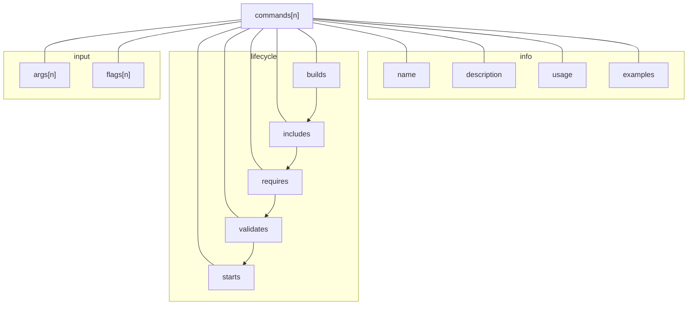

```mermaid
graph TD

command["commands[n]"]
    command --- name
    command --- description
    command --- usage
    command --- examples
    command --- builds

subgraph info
    name
    description
    usage
    examples
end

    command --- includes
    command --- requires
    command --- validates
    command --- starts
subgraph lifecycle
    builds --> includes
    includes --> requires
    requires --> validates
    validates --> starts
end


command --- args
command --- flags

subgraph input
    args["args[n]"]
    flags["flags[n]"]

end
```

